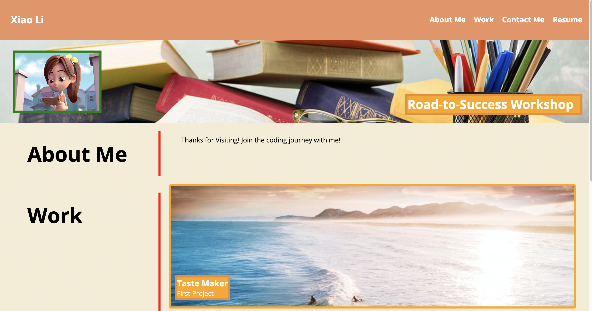

# Professional Portfolio

<p>
    
    
    
</p>


## Table of Contents
1. [Description](#description)
2. [User Story](#user-story)
3. [Screenshot](#screenshot)
4. [Deployed Website](#deployed-website)
5. [Installation](#installation)
6. [License](#license)
7. [Contributing](#contributing)
8. [Test](#test)
9. [Contact Information](#contact-information)

## Description
The task is to create a portfolio that uses the these skills: flexbox, media queries, and CSS variables. 


## User Story
```md
AS AN employer
I WANT to view a potential employee's deployed portfolio of work samples
SO THAT I can review samples of their work and assess whether they're a good candidate for an open position
```

## Screenshot



## Deployed Website
https://shelldan.github.io/portfolio/

## Installation
To clone the repo:
```
git clone https://github.com/shelldan/portfolio.git
``` 

---

## License
[](https://opensource.org/licenses/MIT) 

## Contributing 
There is no contribution allowed at this time. 

---

## Test
It is recommended that you follow this workflow:
```
When you load the portfolio, you should be presented with the developer's name, a recent photo or avatar, and links to sections about them, their work, and how to contact them

When you click one of the links in the navigation, then the UI scrolls to the corresponding section.

When you click on the link to the section about their work, then the UI scrolls to a section with titled images of the developer's applications.

When you are presented with the developer's first application, then that application's image should be larger in size than others

When you click on the images of the applications, then you are taken to that deployed application. 

When you resize the page or view the site on various screens and devices, then you are presented with a responsive layout that adapts to your viewpoint. 
```

---

## Contact Information
* GitHub Username: [shelldan](https://github.com/shelldan)

